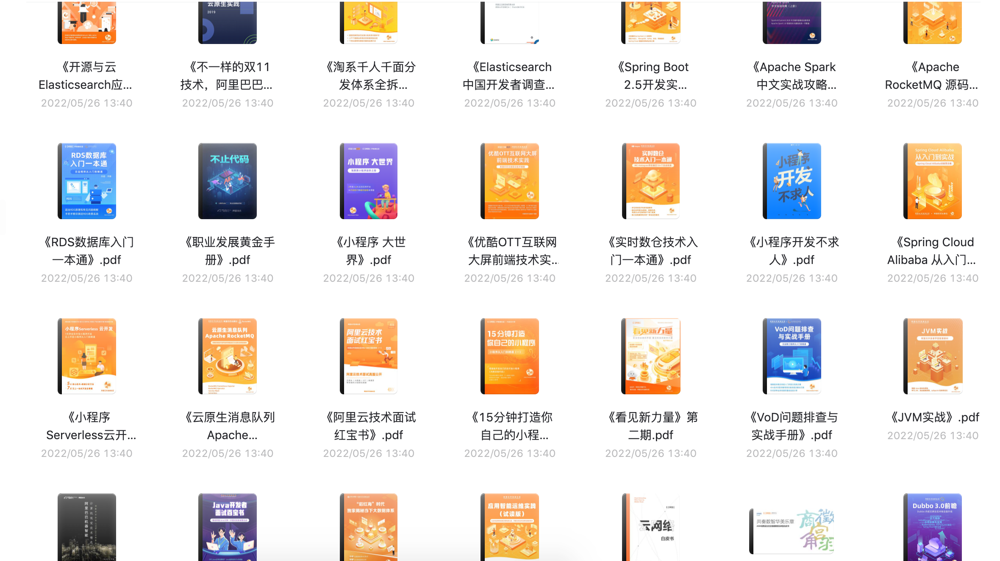

祝大家学习愉快，在题海中自在遨游！

## 在开始学习之前

**1、先给本仓库点个 star，满足一下我的虚荣心**，文章质量绝对值你一个 star。我还在继续创作，给我一点继续分享的动力，感谢。

2、建议关注我的个人微信zxbb12160119，坚持高质量原创，成为好友后，进群学习交流，共同成长；**如遇到网盘链接失效，请联系上述二维码**

3、建议收藏我的在线网站，每篇文章都是作者学习查阅并认为有价值的内容输出：

头条 地址：https://www.toutiao.com/article/7226707645539844612/?log_from=7f3a762ecc6f4_1683473049499

用户昵称：HuggingFace

4、资料内容大纲
1. 基础技术：
    - 一线企业面试笔试真题
    - 架构师进阶视频
    - 架构师精品书籍
    - 微服务进阶视频
    - 58套资深专家简历模板
    - 阿里技术手册
    - 阿里精选205本资料
2. 管理：
    - 项目管理35本方案
3. 数据技术/数据治理
4. AI
5. 开源链接
6. 企业数字化
7. 商业解决方案
    
# 文章目录
### 点击标题可免费获取

### 找工作助手
  * [一线企业面试笔试真题]( https://pan.baidu.com/s/14mCW1L4PpFogQfRbzYiFFQ?pwd=r7hn)

    

    
    

  * [架构师进阶视频](https://pan.baidu.com/s/1bvTvYvraKCyfLCe51YSA8Q?pwd=5px8)

    

    
    

  * [架构师精品书籍](https://pan.baidu.com/s/1pJyI8ySX1-59n529i5jS9g?pwd=m6w2)

    

    
    

  * [微服务进阶视频](https://pan.baidu.com/s/1AiZYhl1KEOpFlmn5DXuzwg?pwd=nvuk)

    

    
    

  * [58套资深专家简历模板](https://pan.baidu.com/s/1Za-L8de5rxkYMIVEOvLnrA?pwd=epk4)

    

    
    

  * [阿里技术手册](https://pan.baidu.com/s/1WWPEaRZgHT7HB18D2ReqVA?pwd=rx3g )

    

    
    

  * [阿里精选205本电子书](https://www.aliyundrive.com/s/gr3UxYZNStv )

    

    
    
    

  * [项目管理](https://pan.baidu.com/s/1koSHTWu6X2E_w8pWiwEHSQ?pwd=nxst)

    

    
    

