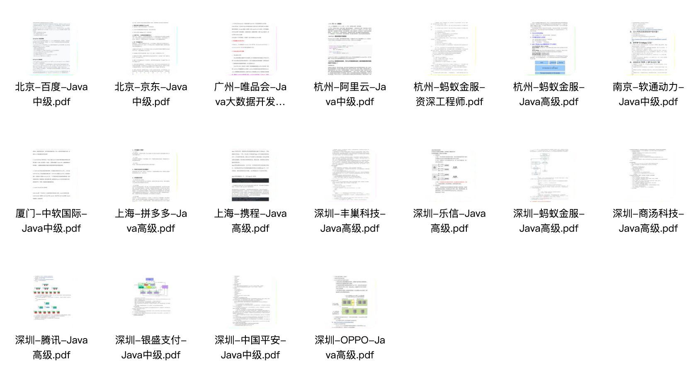

祝大家学习愉快，在题海中自在遨游！

## 在开始学习之前

**1、先给本仓库点个 star，满足一下我的虚荣心**，文章质量绝对值你一个 star。我还在继续创作，给我一点继续写文的动力，感谢。

2、建议关注我的个人微信zxbb12160119，坚持高质量原创，成为好友后，进群学习交流，共同成长：

3、建议收藏我的在线网站，每篇文章都是作者学习查阅并认为有价值的内容输出：

头条 地址：https://labuladong.github.io/algo/

用户昵称：HuggingFace

# 文章目录

### [找工作助手]
  * [一线企业面试笔试真题]( https://pan.baidu.com/s/14mCW1L4PpFogQfRbzYiFFQ?pwd=r7hn 提取码: r7hn )

    

    
    

  * [架构师进阶视频](https://pan.baidu.com/s/1bvTvYvraKCyfLCe51YSA8Q?pwd=5px8 提取码: 5px8[)

    

    
    

    [高级架构师精品书籍]: https://pan.baidu.com/s/1pJyI8ySX1-59n529i5jS9g?pwd=m6w2

    

    
    

